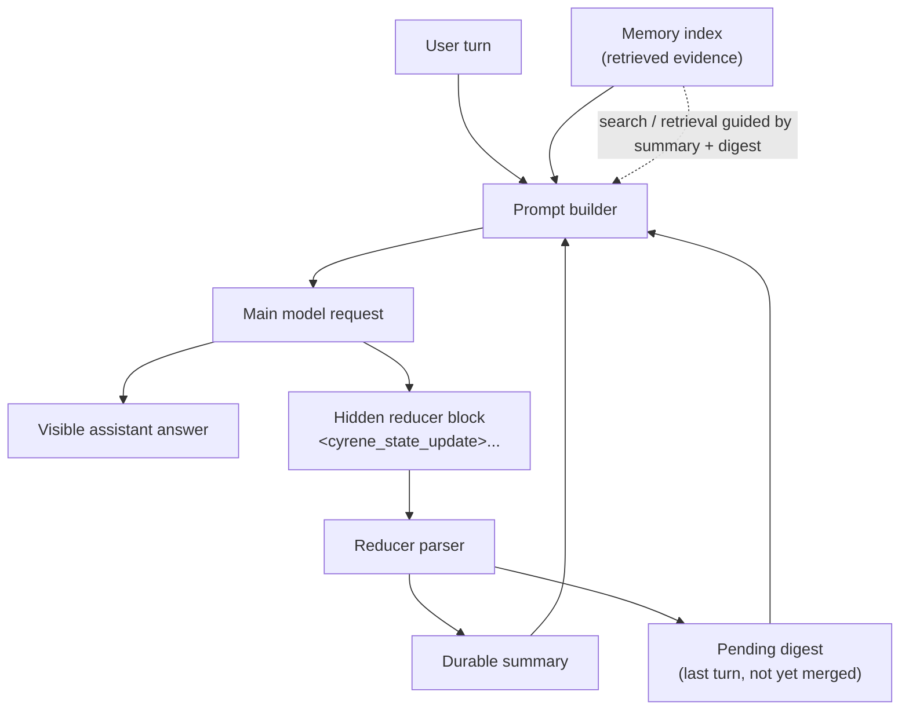
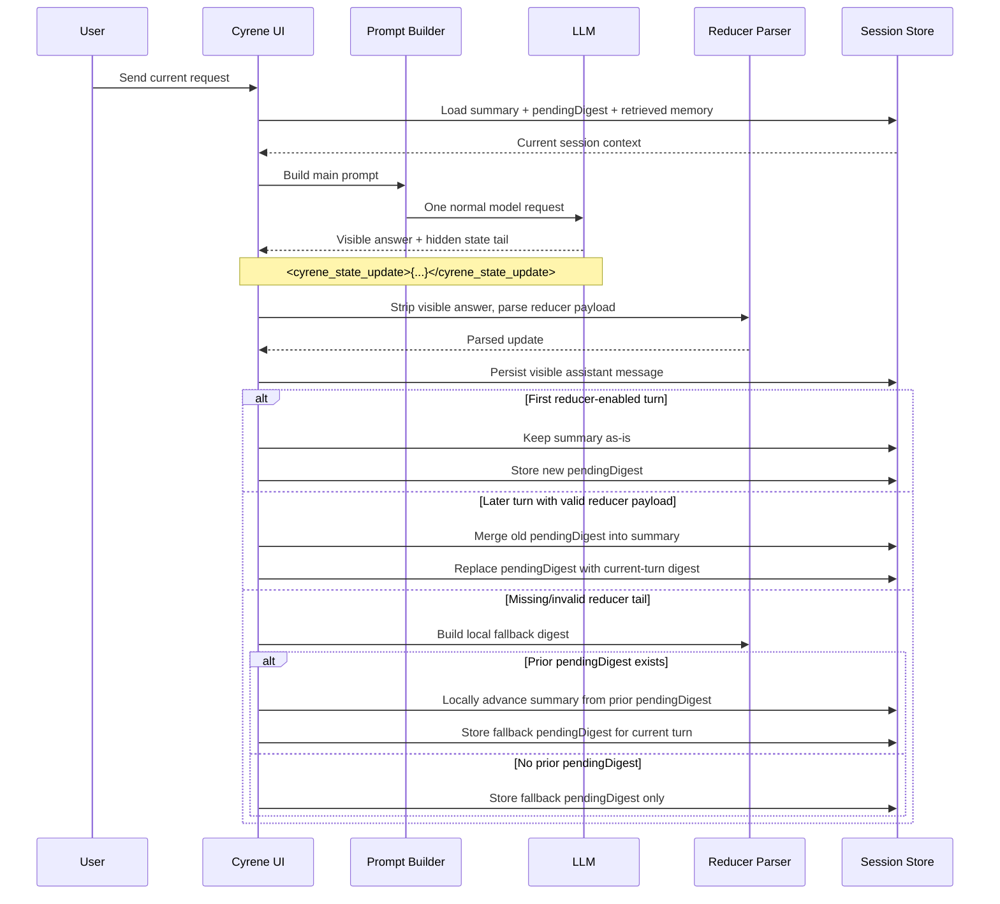

<p align="center">
  
</p>

# Cyrene

Terminal-first coding assistant built with Bun, React Ink, and a reviewable query loop.

## Install

```bash
bun install
```

## Run

```bash
bun dev
```

By default, the CLI runs with a local in-memory core transport, so you can test
the full query loop without any backend service.

## Configure

Put these env vars in your prepared env file to enable OpenAI-compatible HTTP transport:

```bash
CYRENE_BASE_URL=https://your-openai-compatible-host
CYRENE_API_KEY=your_api_key
CYRENE_MODEL=gpt-4o-mini
```

When they are set, the CLI sends `POST /v1/chat/completions` with streaming enabled.
When they are missing, the app falls back to local core transport.

Current request shape:
```json
{
  "model": "gpt-4o-mini",
  "stream": true,
  "messages": [{ "role": "user", "content": "..." }]
}
```

Model switch:
- `/model` opens model picker (Up/Down select, Left/Right page, Enter switch).
- `/model refresh` pulls model list immediately and overwrites `.cyrene/model.yaml`.
- `/model <name>` switches immediately only if model exists in `.cyrene/model.yaml`; otherwise it fails.

Model source priority:
1. `.cyrene/model.yaml`
2. If missing/invalid, fetch from `GET /v1/models`
3. If fetch fails, model initialization fails (and refresh reports failure)

Prompt priority and customization:
- Priority is fixed as: `system prompt > .cyrene/.cyrene.md > pins`.
- User-facing config is centralized in `.cyrene/config.yaml`.
- `system_prompt` can be set in `.cyrene/config.yaml` (or env fallback: `CYRENE_SYSTEM_PROMPT=...`).
- `auto_summary_refresh` can be set in `.cyrene/config.yaml` to enable/disable the rolling reducer that updates `summary` + `pendingDigest` inside normal user turns. Default: `true`.
- Runtime system prompt commands:
  - `/system` show current system prompt
  - `/system <text>` set current runtime system prompt
  - `/system reset` reset to default
- `.cyrene/.cyrene.md` is fully user-editable project policy.
- `/pin <note>` and `/pins` manage human-selected focus.
- `/unpin <index>` removes one pinned focus item (1-based index).

Session and context:
- Sessions are persisted under `.cyrene/session` as JSON files.
- `/help` shows the command reference.
- `/sessions` lists sessions by latest update time.
- `/resume <session_id>` restores a previous session.
- `/resume` opens keyboard picker (Left/Right page, Enter resume, Esc cancel).
- `/new` starts a fresh session.
- `/pin <note>` stores human-selected key context.
- `/pins` shows pinned key context.
- `/unpin <index>` removes a pinned key context item.
- `/state` shows reducer/session state diagnostics for the current runtime.
- Pin count comes from `.cyrene/config.yaml` via `pin_max_count`.
- Older context is tracked through the rolling working-state pair: durable `summary` + lagging `pendingDigest`, while recent turns are kept for prompt context.

## Rolling context architecture

Cyrene keeps long-running coding context in three layers instead of stuffing the
entire transcript back into every prompt:

1. **`summary`** - a durable, compact working state used as the main context anchor
2. **`pendingDigest`** - the most recent turn digest that has not been merged yet
3. **memory index** - richer archived evidence that can be retrieved on demand

This keeps prompts smaller while still preserving continuity. The durable summary
is intentionally structured into sections such as:

- `OBJECTIVE`
- `CONFIRMED FACTS`
- `CONSTRAINTS`
- `COMPLETED`
- `REMAINING`
- `KNOWN PATHS`
- `RECENT FAILURES`
- `NEXT BEST ACTIONS`

### High-level memory layout



### One turn -> summary progression

Cyrene does **not** make a second background summary request after the answer.
Instead, state updates piggyback on the same main response.



### Why this design exists

- avoids a hidden second model call after every answer
- keeps prompt growth bounded
- makes task progress explicit for the model
- lets archive retrieval stay detailed while the working state stays small

Use `/state` during a session to inspect reducer mode, `summary` length,
`pendingDigest` length, and the latest state-update diagnostic.

## Security

See [SECURITY.md](SECURITY.md) for repository security boundaries, disclosure
guidelines, and hardening notes.
