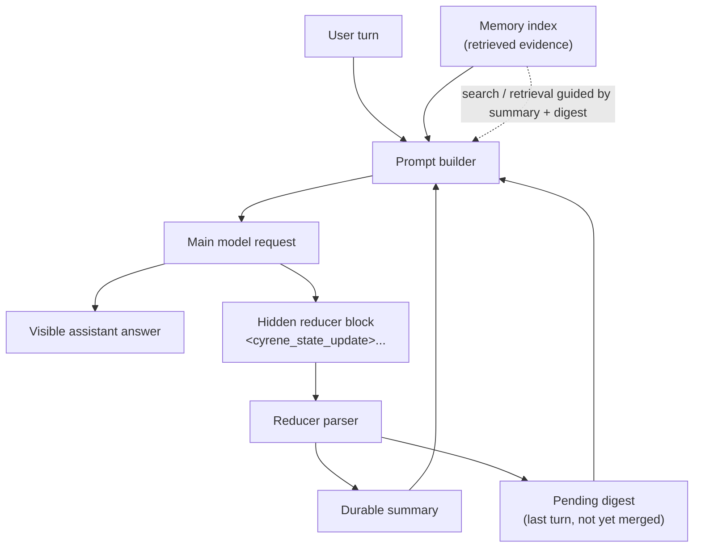
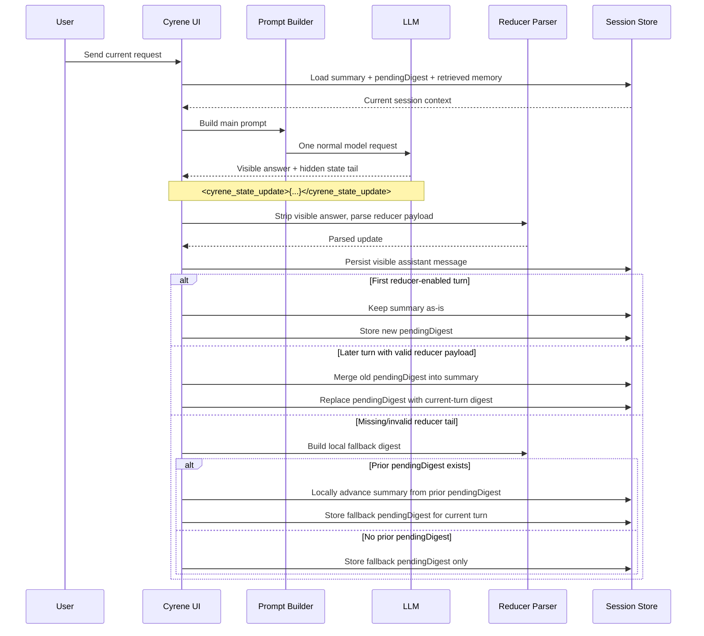

<p align="center">
  
</p>

# Cyrene

Terminal-first coding assistant built around a Bun backend, a Go Bubble Tea terminal UI, and a reviewable query loop.

## Install

### Global CLI

```bash
npm install -g cyrenecode
```

Or run it without a global install:

```bash
npx cyrenecode
```

### From source

```bash
bun install
```

> The published npm package ships a prebuilt CLI bundle. If you are developing
> from source, install Bun first.

## Run from source

```bash
bun dev
```

By default, the CLI runs with a local in-memory core transport, so you can test
the full query loop without any backend service.

## Configure

Cyrene now uses a **global user config home** by default:

- Windows: `C:\Users\<you>\.cyrene`
- macOS / Linux: `~/.cyrene`

Project-local `.cyrene/` is still read for backward compatibility, but global
user scope is the primary home for model/provider metadata and session state.

### HTTP credentials

You can still launch with explicit environment variables:

```bash
CYRENE_BASE_URL=https://your-openai-compatible-host
CYRENE_API_KEY=your_api_key
CYRENE_MODEL=gpt-4o-mini
```

When they are present, they remain the **highest-priority source** for that run.
Cyrene will report them as `process_env` via `/auth` and will not overwrite them
behind your back.

### First-run login onboarding

If usable HTTP credentials are missing, Cyrene auto-opens a skippable login
wizard on the initial idle screen.

Wizard flow:

1. provider base URL
2. API key
3. optional initial model
4. confirmation + persistence target preview

Skip is always allowed. If you skip, Cyrene stays fully usable in `local-core`
mode and you can reconnect later with `/login`.

### What gets persisted where

- **Secret only:** `CYRENE_API_KEY`
  - Windows: user-level environment variable
  - macOS/Linux zsh: managed block in `~/.zshrc`
  - macOS/Linux bash: managed block in `~/.bashrc` or `~/.bash_profile`
  - fish: managed file in `~/.config/fish/conf.d/`
  - other POSIX shells: managed block in `~/.profile`
- **Non-secret provider/model metadata:** global user `.cyrene/model.yaml`

Successful `/login` persists the API key at user scope and also updates the
current CLI process so the transport can switch immediately without restart.
`/logout` removes only the Cyrene-managed persisted API key. It does **not**
delete sessions, summaries, or model/provider catalog files.

When credentials are missing or incomplete, Cyrene falls back to local-core
instead of blocking the app.

#### Shell-specific persistence behavior

- **zsh**: updates one managed block in `~/.zshrc`
- **bash**: uses `~/.bashrc`, otherwise `~/.bash_profile`, otherwise creates `~/.bashrc`
- **fish**: writes `~/.config/fish/conf.d/cyrene-auth.fish`
- **other POSIX shells**: updates one managed block in `~/.profile`

Repeated `/login` updates replace the existing Cyrene-managed entry instead of
duplicating it. `/logout` removes only the Cyrene-managed block or file and
does not touch unrelated shell configuration.

Current request shape:
```json
{
  "model": "gpt-4o-mini",
  "stream": true,
  "messages": [{ "role": "user", "content": "..." }]
}
```

Model switch:
- `/model` opens model picker (Up/Down select, Left/Right page, Enter switch).
- `/model refresh` pulls model list immediately and overwrites `.cyrene/model.yaml`.
- `/model <name>` switches immediately only if model exists in `.cyrene/model.yaml`; otherwise it fails.
- `/login` opens the auth wizard on demand.
- `/logout` removes Cyrene-managed user-scoped API key persistence.
- `/auth` shows the current mode, credential source, and persistence target.

Model source priority:
1. `.cyrene/model.yaml`
2. If missing/invalid, fetch from `GET /v1/models`
3. If fetch fails, model initialization fails (and refresh reports failure)

Prompt priority and customization:
- Priority is fixed as: `system prompt > .cyrene/.cyrene.md > pins`.
- User-facing config is centralized in `.cyrene/config.yaml`.
- `system_prompt` can be set in `.cyrene/config.yaml` (or env fallback: `CYRENE_SYSTEM_PROMPT=...`).
- `auto_summary_refresh` can be set in `.cyrene/config.yaml` to enable/disable the rolling reducer that updates `summary` + `pendingDigest` inside normal user turns. Default: `true`.
- `request_temperature` can be set in `.cyrene/config.yaml` to control the HTTP main-request sampling temperature. Default: `0.2`.
- Runtime system prompt commands:
  - `/system` show current system prompt
  - `/system <text>` set current runtime system prompt
  - `/system reset` reset to default
- `.cyrene/.cyrene.md` is fully user-editable project policy.
- `/pin <note>` and `/pins` manage human-selected focus.
- `/unpin <index>` removes one pinned focus item (1-based index).

Session and context:
- Sessions are persisted under `.cyrene/session` as JSON files.
- `/help` shows the command reference.
- `/sessions` lists sessions by latest update time.
- `/resume <session_id>` restores a previous session.
- `/resume` opens keyboard picker (Left/Right page, Enter resume, Esc cancel).
- `/new` starts a fresh session.
- `/pin <note>` stores human-selected key context.
- `/pins` shows pinned key context.
- `/unpin <index>` removes a pinned key context item.
- `/state` shows reducer/session state diagnostics for the current runtime.
- `/auth` shows whether the runtime is using HTTP or local-core, plus where the
  current credential came from.
- Pin count comes from `.cyrene/config.yaml` via `pin_max_count`.
- Older context is tracked through the rolling working-state pair: durable `summary` + lagging `pendingDigest`, while recent turns are kept for prompt context.

## Semantic code tools and LSP

The built-in filesystem MCP server can expose semantic navigation helpers in
addition to plain text file/search tools.

- **TypeScript / JavaScript** tools are available through the bundled tsserver
  client: `ts_hover`, `ts_definition`, `ts_references`, `ts_diagnostics`, and
  `ts_prepare_rename`.
- **Generic LSP** tools are available when you configure one or more language
  servers under a filesystem MCP server:
  `lsp_hover`, `lsp_definition`, `lsp_references`,
  `lsp_document_symbols`, `lsp_diagnostics`, and `lsp_prepare_rename`.

Example `.cyrene/mcp.yaml`:

```yaml
primary_server: filesystem
servers:
  - id: repo
    transport: filesystem
    workspace_root: .
    lsp_servers:
      - id: rust
        command: rust-analyzer
        file_patterns: ["**/*.rs"]
        root_markers: ["Cargo.toml", ".git"]
      - id: python
        command: pyright-langserver
        args: ["--stdio"]
        file_patterns: ["**/*.py"]
        root_markers: ["pyproject.toml", "setup.py", ".git"]
```

Notes:

- `command` / `args` should launch the language server already installed on your
  machine. Cyrene does not bundle the external LSP binaries.
- `file_patterns` decide which files are routed to each language server.
- `root_markers` help Cyrene choose the nearest project root for each LSP
  session.
- `workspace_root`, `env`, `initialization_options`, and `settings` are also
  supported per `lsp_servers` entry when you need them.
- If more than one configured LSP server can match the same file, pass
  `serverId` with the `lsp_*` action.
- `ts_prepare_rename` and `lsp_prepare_rename` only prepare a rename preview;
  they do not mutate files by themselves.

## Rolling context architecture

Cyrene keeps long-running coding context in three layers instead of stuffing the
entire transcript back into every prompt:

1. **`summary`** - a durable, compact working state used as the main context anchor
2. **`pendingDigest`** - the most recent turn digest that has not been merged yet
3. **memory index** - richer archived evidence that can be retrieved on demand

This keeps prompts smaller while still preserving continuity. The durable summary
is intentionally structured into sections such as:

- `OBJECTIVE`
- `CONFIRMED FACTS`
- `CONSTRAINTS`
- `COMPLETED`
- `REMAINING`
- `KNOWN PATHS`
- `RECENT FAILURES`
- `NEXT BEST ACTIONS`

### High-level memory layout



### One turn -> summary progression

Cyrene does **not** make a second background summary request after the answer.
Instead, state updates piggyback on the same main response.



### Why this design exists

- avoids a hidden second model call after every answer
- keeps prompt growth bounded
- makes task progress explicit for the model
- lets archive retrieval stay detailed while the working state stays small

Use `/state` during a session to inspect reducer mode, `summary` length,
`pendingDigest` length, and the latest state-update diagnostic.

## Security

See [SECURITY.md](SECURITY.md) for repository security boundaries, disclosure
guidelines, and hardening notes.

## License

[MIT](LICENSE)
